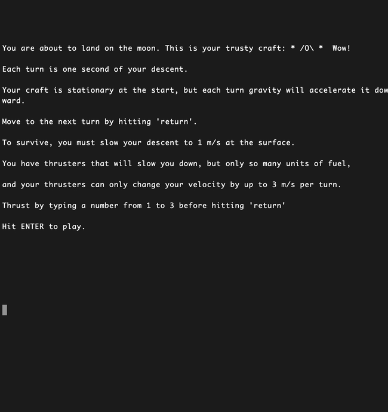

## This is MOON LANDER

A Unix CLI game written in Ruby.

Simple as it may be, this game still provides a challenge. The ship has only so much fuel, and will accelerate towards the surface until you crash unless you use your thrusters strategically. Hit enter to progress through turns. Enter a number from 1-3 before hitting enter to modify how hard to pulse your thrusters. Safe landings!

To play, clone and run command `ruby Play_Moon_Lander.rb` from the project directory.

Enjoy the randomly generated stars.

